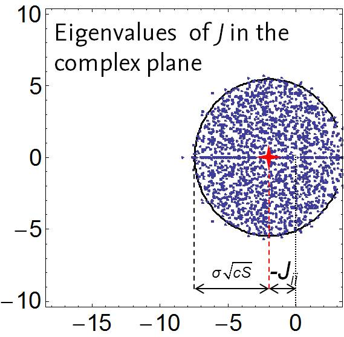
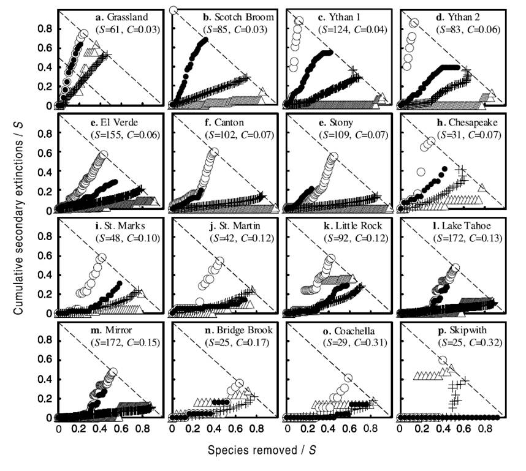

# Interaction networks, food webs, and complexity in ecology (Day 4)

## Preamble of the script used during the course

```{r}
library(cheddar)
library(igraph)
library(vegan)
library(sbm)
library(alluvial)
library(faux)
library(devtools) 
#Sys.unsetenv("GITHUB_PAT")
#install_github("FMestre1/fw_package")
library(FWebs)
library(matlib)
library(calculus)
library(pracma)
source('functions_network.R')

####In FWebs, there is a large list of food webs called mg1
sapply(1:length(mg1[[1]]),function(x) dim(as.matrix(mg1[[1]][[x]]))[1])

####Extract data from web 1,223
mat<-as.matrix(mg1[[1]][[223]])
plotMyMatrix(mat)
net.mat<-graph_from_adjacency_matrix(mat,mode="directed")
```

TO DO: change the way FWebs is used because it does not compile on Mac and Linux...

## Networks and associated definitions

### What is a network?
Networks (or graphs) are sets of nodes linked by edges.
Edges represent pairwise relationships between nodes.
Edges can be directed or not, weighted or binary (0/1).

### Networks in ecology
The main types of networks that you can encounter in ecology:
- the most common: interaction networks (edges are interactions, nodes are species)
- less common: spatial networks (edges are spatial connections, nodes are populations on a map)
- the rarest: assembly networks (edges are transitions between community compositions, nodes are community compositions)

### Ecological interaction networks
Since biotic interactions are very diverse, many different types of interaction networks can be built (mutualistic, antagonistic, etc.).
The type of data that can be obtained on networks is manifold:
- interaction frequency, especially from field observations (e.g. how many times a pollinator species is observed on a particular plant species);
- co-abundances or co-occurrences of the species pairs;
- interaction potentials, mostly obtained from experiments (e.g. arena experiments in which species are put together pairwise to observe interactions)

### A little history
The study of ecological interaction networks begun as early as the 50's with some landmark papers like Hutchinson's (Santa Rosalia, etc.) or Paine's series of keystone predation papers. The book of Allee is remarkable as it contains some of the earliest diagrams of food webs.

### Types of network
#### Unipartite networks
One large class of ecological networks is unipartite networks, i.e. messy ones in which interactions can occur between any two species. E.g. the Benguela food web of Yodzis (1998).
The function sample_gnp can generate random unipartite networks using the Erdos-Reyi model, which assumes that any interaction has the same probability to exist.
The plot function of igraph makes basic plots of networks, the layout option helps see things a wee bit more clearly.

```{r}
net<-sample_gnp(30,0.2,directed = FALSE)
plot(net)
net<-sample_gnp(30,0.2, directed =TRUE)
plot(net)

plot(net.mat,layout=layout_with_mds)
plot(net.mat,layout=layout_as_tree)
```

#### Multipartite networks
Another large class of networks is the one consisting of multipartite networks, i.e. networks in which nodes can be partitioned among different levels and nodes only interact among different levels and never within the same level.
Each species/node then has a "role" which defines its "level".
The most common type of multipartite network encountered in ecology is bipartite network (only two levels) such as plant-pollinator networks.
The function sample_bipartite generates a random bipartite network using the Erdos-Renyi model.

```{r}
net<-sample_bipartite(20,20,"gnp",0.1)
plot(net,layout=layout_as_bipartite)
```

## Representation of networks
### Binary networks
Having networks as collections of nodes and edges can be insightful, but to make computations on networks, one needs to express them using useful mathematical object. The easiest way is to express a network as a matrix called the adjacency matrix. The element $a_{ij}$ of an adjacency matrix is equal to 1 iff there exists an interaction between species $i$ and $j$. This also works for directed networks.
The function sample_grg given here generates a random graph based on a random geometric graph process -- it assumes that nodes have coordinates in 2D within a 1 x 1 square and interactions exist when the distance between two nodes is less than a given threshold (here, 0.2).
The function as_adjacency_matrix yields the adjacency matrix of the network.

```{r}
net<-sample_grg(30, 0.2)
as_adjacency_matrix(net)
```

### Weighted networks
When a network is weighted, the weighted adjacency matrix represents not only the existing/absent interactions, but also how strong these interactions are.
Here, we create random weights for the edges of network "net" using a Poisson distribution of mean 2.
Adding "[,]" after the name of network also yields the adjacency matrix.

```{r}
E(net)$weight<-rpois(length(E(net)),2)
net[,]
```

### Network matrices
Quite naturally, if a network is undirected, its adjacency matrix will be symmetric. When a network is directed, it will not necessarily be so.
One tricky item to keep in mind: sometimes food webs can be represented not using an adjacency matrix, but rather using an "energy flux" matrix which represents interactions as an antisymmetric matrix of +1's and -1's.
Adjacency matrices can be binary or real-valued (if they represent interaction weights).
A source of confusion can be the difference between adjacency and incidence matrices.

### Matrices for multipartite networks
In bipartite networks, the diagonal blocks of the adjacency matrix are full of 0 only. It is thus more useful to only look at the (rectangle) non-zero off-diagonal blocks, which are called the incidence matrix in ecology (or bi-adjacency matrix in other disciplines).
The function as_biadjacency_matrix of igraph extracts this matrix from a bipartite network.

```{r}
net<-sample_bipartite(4,4,"gnm",m=8)
net[,]
as_biadjacency_matrix(net)
```

### Degrees
A basic element of representation of networks is the degree of a node.
The degree of a node is the number of interactions it shares with other nodes.
For undirected networks, this definition is straightforward and corresponds to row- or column-sums of the binary adjacency matrix.
For directed networks, one actually needs to define the in-degree and out-degree of each node, which correspond respectively to the number of incoming and outgoing edges.
The function degree of igraph computes all of these using the argument called mode.

```{r}
degree(net)
degree(net,mode="in")
degree(net,mode="out")
```

The degree distribution corresponds to the realized empirical distribution of degrees in the network. It can be obtained using a variety of functions, including degree_distribution in igraph.

```{r}
hist(degree(net.mat),breaks=0:max(degree(net.mat)))
plot(degree_distribution(net.mat, cumulative = TRUE))
```

### Connectance
Connectance is an important notion. It is defined as the proportion of possible interactions that really exist. There are plenty of ways to implement its computation (e.g. using mean), but it is important to correct these according to the impossible interactions (e.g. correcting for self-links or edges within levels in bipartite networks).

```{r}
conn<-mean(as.matrix(net.mat[,]))
conn
```

## Crash course: matrices, eigenvalues, Jacobian matrix

### Crash course: matrices
Matrices are mathematical objects that represent tables, i.e. have rows and columns. The element at row $i$ and column $j$ of matrix $M$ is often noted $m_{ij}$.
Matrices and vectors follow a strange multiplication operation, noted with %*% in R (rather than * which encodes a more plastic multiplication operation).

```{r}
m<-matrix(rbinom(9,1,0.5),nrow=3)
x<-rnorm(3)
m*x
m%*%x
```

### Crash course: matrix eigenvalues
All matrices are associated with a set of values called "eigenvalues" which represent the "multiplicators" of the matrix. Each of these eigenvalues $\lambda$ is associated to eigenvectors $x$ such that multiplying $x$ by the matrix $M$ results in only multiplying $x$ by $\lambda$:
$$M.x = \lambda x$$

The collection of eigenvalues of $M$ is called its spectrum. The spectrum is always finite and has at most a number of distinct elements equal to the smallest dimension of $M$.

The function eigen yields the eigensystem (eigenvalues and eigenvectors) of a matrix.

```{r}
eigen(m)
```

### Crash course: Jacobian matrices
A set of ordinary differential equations (ODEs), such as those given by Lotka-Volterra equations, can be written in compact form as:

$$\frac{d\overrightarrow{x}}{dt} = \overrightarrow{F}\left(\overrightarrow{x} \right)$$

Let us assume that there exists an equilibrium $\overrightarrow{x}^*$ for this system. If we want to assess whether this equilibrium is stable, we need to linearize the dynamics around the equilibrium:

$$\frac{d\left( \overrightarrow{x}-\overrightarrow{x}^*\right)}{dt} \approx J\left(\overrightarrow{x}^*\right).\left( \overrightarrow{x}-\overrightarrow{x}^*\right)$$

The matrix $J\left(\overrightarrow{x}^*\right)$ is called the Jacobian matrix of the dynamical system at the equilibirum $\overrightarrow{x}^*$
The expression for eh Jacobian matrix is obtained using the partial derivatives of the different components of $\overrightarrow{F}$:
$$J\left(\overrightarrow{x}^*\right) = \left.\left(\partial F_i/\partial x_j\right)\right\rvert_{x=x^*}$$

Formal computations of Jacobian matrices can be done with R using the package calculus:

```{r}
#jacobian(c("r*n1*(1-n1/k)-a*n1*n2/(1+h*n1)","b*n1*n2/(1+h*n1)-d*n2"), var = c("n1", "n2"))
```

## Theories and notable results

### Lotka-Volterra and networks
This is the classic Lotka-Volterra system, given for a dimensionless system (i.e. the coefficient of self-feedback are all set to 1):
$$\frac{dx_i}{dt} = x_i \left[ r_i - x_i + \sum_j a_{ij}x_j\right]$$
This system of ODEs can be seen as describing the dynamics of a network of species, with matrix $A$ as its "weighted" adjacency matrix.

### May's stability result
In the 70's, Sir Robert May published a very important mathematical ecology result which shook some of the beliefs ecologists had at that time.
The idea is to assume that a community consists of $S$ species and that species abundances of these species are fixed at an equilibrium value $\overrightarrow{x}^*$. May's approach asks the question: what should happen if elements of the Jacobian matrix were randomly drawn according to a simple distribution? More precisely, May assumed that diagonal elements of the Jacobian were equal (or similar) and negative, while the off-diagonal elements had a probability $c$ (the connectance) of being non-zero, and if not equal to zero, followed a normal distribution of mean 0 and standard deviation $\sigma$.
The result of May thus stipulates that the equilibrium can only be stable when
$$\begin{equation} 
\sigma \sqrt{cS} < -\overline{J_{ii}} 
\end{equation}$$

This result can be explained geometrically (based on the circular law): for a random matrix with this particular distribution of off-diagonal elements, the distribution of eigenvalues will be enclosed in a disk of center $\left(-\overline{J_{ii}},0\right)$ and radius $\sigma \sqrt{cS}$ in the complex plane. For all eigenvalues to have negative real parts, the radius of this disk should be less than the distance between (0,0) and its center.

```{r,echo=FALSE}

```

```{r}
m<-matrix(rnorm(10^6),nrow=10^3)
plot(eigen(m)$values,asp=1)
```
This result can be interpreted as follows: for a given equilibrium to be stable, it should have low diversity and/or low connectance and/or a low variability of non-diagonal Jacobian elements (i.e. feedbacks among species abundances) and/or highly negative diagonal Jacobian elements (i.e. strong negative feedbacks of species upon themselves).

Intuitively, this does not seem to conform to reality: we see species-rich systems in which species interact relatively strongly and not too sparsely, without intense self-regulation...
So, some of the assumptions must be false and we can look for changes to these assumptions:
- dynamics could be transient rather than at equilibrium
- interactions might be structured and not completely random (see Claire's talk)

### Feasibility vs. stability
One other strong argument contradicting May's result is the following: in many cases, it might actually be more difficult to obtain an equilibrium including all species (i.e. have feasibility) than for this equilibrium to be stable.
For instance, Bizeul & Najim proved that in a certain class of LV systems, feasibility is obtained only when 
$$\sigma \sqrt{2Slog(S)} < -\overline{J_{ii}}$$
where $\sigma$ is the standard deviation of the LV matrix (not the Jacobian matrix) and the connectance is merged into $\sigma^2$.

In the simulation paper of L. Stone, similar results were obtained -- here stability (on the left) is lost after feasibility (on the right) when increasing of a parameter ($\gamma$) which is proportional to our $\sigma$.

```{r,echo=FALSE}
knitr::include_graphics("fig06Networks/Stone.jpg")
```

### Food web invariants
In the 80-90's, one important goal of interaction network research was to find invariant properties, i.e. statistics or metrics that did not vary among food webs. With this goal in mind, two models were proposed.
First, the cascade model of Cohen & Briand proposed that predators only eat a rather fixed number of prey species. This corresponds to predators eating prey that are are smaller than them with probability $c/S$ ($c$ being a fixed parameter), so that connectance decreases as $1/S$.
```{r}
m<-cascade_matrix(10,20)
sum(m)/(dim(m)[1]*(dim(m)[1]-1))

m<-cascade_matrix(10,200)
sum(m)/(dim(m)[1]*(dim(m)[1]-1))
```

The second model that was developed to find invariants is the niche model of Williams and Martinez. In this model, all species are supposed to be defined by their size and to eat all species with size contained within an interval centred around a size lower than the predator's.
With the right parameter values, one can use this model to generate a food web that has a given connectance, whatever the number of species in the food web.

```{r}
niche<-niche_matrix(0.2,100)
m<-niche$matrix
sum(m)/(dim(m)[1]^2)

niche<-niche_matrix(0.2,200)
m<-niche$matrix
sum(m)/(dim(m)[1]^2)
```
### Generating the niche model
Exercise: generate 100 virtual food webs similar to the one described by mat

```{r}
niches<-lapply(1:100,function(x) niche_matrix(conn,dim(mat)[1]))
ms<-lapply(1:100,function(x) niches[[x]]$matrix)
```

### Robustness to secondary extinctions
The general idea is to assume that when a species is removed from a network, the species interacting with it could go extinct (secondary extinction).
Robustness analysis then consists in assessing how many species are lost when R species are removed.
The most used indicator of robustness is the R50 which is the percentage of species on needs to remove from a web to lose 50% of its species.

```{r,echo=FALSE}

```

In the paper of J. Dunne and collaborators, they used examples based on a variety of datasets. The basic rule then is that a species go extinct when it loses all its prey items (except itself if it is cannibalistic).
One can obtain different scenarios based on how removed species are chosen (intentionality: how strongly the species' degree changes its probability of being drawn randomly as the next one to be removed).

```{r,echo=FALSE}
knitr::include_graphics("fig06Networks/Dunne2.jpg")
```

```{r}
net<-graph_from_adjacency_matrix(m,mode="directed")
i_index <- seq(from = 0, to = 1, by =0.1)
i_index <- head(i_index,-1)
prob_exp<-exponent.removal(net, i_index)
V(net)$name<-1:200
iterate(fw_to_attack=net, prob_exp, alpha1=50, iter=10, i_index, plot = TRUE)
```

## A quick primer on network statistics

### Degree distributions
Basically, one can do three things with degree distributions:
- compute them empirically
- generate networks similar to one that is observed using its degree sequence
- compare the degree distribution to benchmark distributions of integers (Poisson, power law, ...) or of degrees of well-known random networks (Erdos-Renyi, random geometric graph, Watts-Strogatz...)

```{r,echo=FALSE}
knitr::include_graphics("fig06Networks/Dunne3.jpg")
```

```{r}
net<-graph_from_adjacency_matrix(m)
hist(degree(net),breaks=0:max(degree(net)))
plot(degree_distribution(net, cumulative = TRUE))

net<-sample_degseq(degree(net),method = "vl")

mean(degree(net))
ks.test(degree(net),"pbinom",length(V(net)),mean(degree(net))/length(V(net)))
```

Power laws are among the most popular distributions of degrees discussed in the literature. However, a question worth asking is whether power laws are useful in ecology, i.e. whether it is actually possible to ascertain power-lawed degrees in ecological networks.
As Stumpf & Porter (2012) clearly articulated, this would require to have degrees ranging at the very least between 1 and 100  (2 orders of magnitude), which is quite unheard of.

### Null models / randomizations

Statistics on networks are hard to test because everything depends on everything else in a network...

So to test for extraordinary patterns in a network (or between them), one can resort to two strategies:
- either to define a probabilistic model to build a null hypothesis (e.g. using the expected degree distribution)
- or to define a null model based on some randomization scheme

One of the most useful and simplest such scheme is the configuration model. Under this null model, edges are randomly reattached to other nodes such that all nodes keep their degrees. This behaves effectively as if all nodes were attached to half-edges which were randomly paired until the resulting network yields no self-link and no double link.

```{r,echo=FALSE}
knitr::include_graphics("fig06Networks/configuration.jpg")
```

For bipartite binary networks, there is an algorithm (curveball) which yields the configuration model quickly and efficiently.

```{r}
net<-sample_bipartite(50,50,"gnp",0.1)
sample.bip.config<-simulate(nullmodel(as_incidence_matrix(net),"curveball"),nsim=1000)
dim(sample.bip.config)
```

For unipartite binary networks, the task is slightly harder, but doable using sample_degseq.

```{r}
n<-200 #1000
net<-sample_gnp(n,0.2, directed = FALSE)
sample.config.undirected<-lapply(1:100,function(x) sample_degseq(degree(net), method = "vl"))
length(sample.config.undirected)
```

For directed networks, it is even worse because we have no indication that the random matrices are all explored and represented fairly among the realizations of the algorithm.

```{r}
net<-sample_gnp(n,0.2, directed = TRUE)
sample.config.directed<-lapply(1:100,function(x) sample_degseq(degree(net,mode="out"), degree(net,mode="in"), method = "simple.no.multiple"))
length(sample.config.directed)
```

Finally, for any weighted network (bipartite or unipartite), the task is even more difficult.

### Network structure
Ecological interaction networks can have non-random structures. In ecology, we tend to focus on two such structures: modularity (on the left) and nestedness (on the right).

```{r,echo=FALSE}
knitr::include_graphics("fig06Networks/Lewinsohn.jpg")
```

In the following we will more strongly focus on modularity than on nestedness, for reasons that will be explained later.

### Modularity
Modularity, as defined by Newman, is given by the following formula:
$$\begin{equation}
Q = \frac{1}{A} \sum_{i,j} \left[ a_{ij} - \frac{d_i d_j}{A}\right]\delta_{ij}
\end{equation}$$
where $A$ is the total number of connections in the network (i.e. $A = \sum_i \sum_j a_{ij}$), $d_i$ is the degree of species $i$ (i.e. $d_i = \sum_j a_{ij}$) and the $\delta_{ij}$ are dummy variables indicating whether species/nodes $i$ and $j$ are assumed to belong to the same module/community/cluster. 
In layman's terms, modularity is a quantity that measures how ``intense'' interactions are within modules, and thus by contrast how little interaction there is between nodes belonging to different modules.
The principle of modularity search is to look for the partitioning of nodes into communities/modules that maximizes the associated modularity score. 
The problem of modularity search is quite complex (NP-complete problem) and thus can be solved with different algorithms that have their pros and cons.

Modularity, in its classic form, only works for undirected networks.
Three algorithms that are often used in ecology are the edge-betweenness algorithm (EB), the leading-eigenvector one (LE) and the Louvain algorithm (ML).

```{r}
net<-sample_gnp(100,0.2, directed = FALSE)
EB.mod<-cluster_edge_betweenness(net)
LE.mod<-cluster_leading_eigen(net)
ML.mod<-cluster_louvain(net)

plot(EB.mod,net,layout = layout_with_mds)
plot(LE.mod,net,layout = layout_with_mds)
plot(ML.mod,net,layout = layout_with_mds)
```

Again, modularity is not adapted to directed networks, but there ways to circumvent this issue:
- by making the network/adjacency matrix symmetric
- through the use of another definition of modularity (e.g. the infomap definition of Rosvall and Bergström)

#### Modularity of the empirical food web
As mentioned before, it is highly recommended to check whether the obtained modularity is ``expected'' or extraordinary using a null model. Here is an example using the empirical food web.

```{r}
modul<-cluster_louvain(graph_from_adjacency_matrix(mat,mode="undirected"))
moduls<-lapply(1:100,function(x) cluster_louvain(graph_from_adjacency_matrix(ms[[x]],mode="undirected"))$modularity)
plot(density(unlist(moduls)))
modul.ecdf<-ecdf(unlist(moduls))
1-modul.ecdf(modul$modularity[2])
```

#### Which algorithm?
Because there are tons of algorithms already developed to find clusters/communities/modules in networks, it is easy to get lost... Yet two papers (at least) have made our life easier by comparing all these algorithms, bot for unipartite networks (Yang et al. 2016) and bipartite networks (Leger et al. 2015).

### Block models
Another possibility when looking for clusters of species that interact more among themselves is to look for blocks of nodes/species that ``behave'' similarly. This can be achieved using stochastic block models (SBM), also sometimes called latent block models (LBM) when dealing with bipartite networks.

Block models work by optimizing the fit of a model (in the classic statistical sense) which assigns probability of membership to groups and probability of interaction between nodes of known groups.
Block models can be fitted on different kinds of adjacency matrices following different distributions (e.g. Bernoulli for binary adjacency matrices, Poisson for counts, etc.).
The inference of a block model yields one parameter per block (the ``expected connection'' within the block) and the proportions of nodes belonging to each group.

```{r}
sbmnet <- sampleSimpleSBM(100, c(.5, .25, .25), list(mean = diag(.4, 3) + 0.05), model = 'bernoulli')
head(sbmnet$networkData)
net.SBM <- estimateSimpleSBM(as.matrix(sbmnet$networkData))
plot(net.SBM, 'expected')
plot(net.SBM, 'data')
```

### Modularity and blocks
It is possible to compare the partitionings of nodes obtained through modularity search and SBMs, for instance comparing the result of Louvain algorithm with a simple SBM on the network given by mat.

The alluvial plot helps visualize the correspondence between these groups.
```{r}
m.SBM <- estimateSimpleSBM(mat)
modul<-cluster_louvain(graph_from_adjacency_matrix(mat,mode="undirected"))
make_alluvial_2(m.SBM$memberships,modul$membership,"Blocks","Modules")
```

It is also possible to look at whether these groupings have anything to do with trophic level (sensus MacKay et al.).
```{r}
count_components(net.mat)
net.comp<-components(net.mat)
tl.1<-trophic_levels(largest_component(net.mat))
plot(largest_component(net.mat),layout = layout_as_food_web)
plot(tl.1~as.factor(m.SBM$indMemberships[which(net.comp$membership==1),]%*%(1:3)),xlab="SBM group",ylab="Trophic level")
plot(tl.1~as.factor(modul$membership[which(net.comp$membership==1)]),xlab="module",ylab="Trophic level")
```

As we can see, SBM-derived groups seem to be better at capturing trophic levels.

### Spectral clustering
One drawback of SBM is that they can be slow to converge, especially when the dataset is big. A convenient replacement algorithm when the number of groups to look for is known (or can be easily guessed) is spectral clustering.
The idea of spectral clustering is to make use of the Laplacian matrix $L$ of the graph, given by:
$$L = D - A$$
where $D$ is the diagonal matrix of nodes' degrees and $A$ is the adjacency matrix.

The Laplacian matrix has interesting properties, the best of all being that the number of zeros among its eigenvalues yield the number of components of the graph (one 0 means there is a single connected component, two zeros means the network is split in two disconnected components, etc.). The eigenvectors associated the zero eigenvalues can inform on the membership of nodes to the different components.

The heuristics of the spectral clustering is to use the eigenvectors associated with the set of small non-zero eigenvalues of $L$ to deduce the ``almost components'' of the graph. To do so, one chooses a number of no-zero eigenvalues to keep and then the algorithm uses the associated eigenvector to find the groups through a K-means algorithm on the space obtained with these eigenvectors.

Here is an example of spectral clustering on the previous block-model graph.

```{r}
SC<-spectral_clustering(graph_from_adjacency_matrix(sbmnet$networkData),3)
plotMyMatrix(sbmnet$networkData,clustering=list("row"=SC,"col"=SC))
```

### Nestedness
The idea of nestedness is to measure the tendency for specialists to only interact with a subsample of the interactors of generalists. In other words, a network would be said ``non-nested'' only when specialists would interact more likely with specialists than with generalists.

Several indices have been developed over the years. Navigating their complexity is the purpose of the synthesis written by Podani and Schmera (2012).

I will not delve too long on the topic of nestedness because recent research seem to indicate that the concept is not really fruitful for a variety of reasons:
- it seems to be very strongly linked to connectance
- the diversity of nestedness indices tend to obfuscate its meaning (results reported show more about the index than about the concept)
- these different indices can yield very different results when applied to the same dataset
- in the classic case of power law distributions of degrees, the nestedness scores tend to be completely detrmined by the exponent of the power law
- finally, when putting the common datasets in the right matrix ensemble (i.e. using correct null models to sample similar matrices), reported nestedness values seem to be completely expected.

### Last words
- ecological interaction networks can be used to study community or ecosystem properties
- random network models can help gauge generalities and specificities of networks
- all network patterns do not have a mechanistic model-based explanation yet, but some do (like the link between feasibility, stability, or robustness and connectance)
- interaction network data of different types lend themselves to different analyses (e.g. modularity for binary networks, value adjacency matrix with signed interactions for May-like analyses)

## Literature

Astegiano, J., Guimarães Jr, P. R., Cheptou, P.-O., Vidal, M. M., Mandai, C. Y., Ashworth, L. & Massol, F. (2015) Persistence of plants and pollinators in the face of habitat loss: Insights from trait-based metacommunity models. Advances in Ecological Research - vol. 53 (eds G. Woodward & D. A. Bohan), pp. 201-257. Academic Press.

Bizeul, P. & Najim, J. (2021) Positive solutions for large random linear systems. Proceedings of the American Mathematical Society, 149, 2333-2348.

Clauset, A., Shalizi, C. R. & Newman, M. E. J. (2009) Power-law distributions in empirical data. SIAM Review, 51, 661-703.

Dunne, J. A., Williams, R. J. & Martinez, N. D. (2002) Food-web structure and network theory: The role of connectance and size. Proceedings of the National Academy of Sciences, 99, 12917-12922.

Dunne, J. A., Williams, R. J. & Martinez, N. D. (2002) Network structure and biodiversity loss in food webs: robustness increases with connectance. Ecology Letters, 5, 558-567.

James, A., Pitchford, J. W. & Plank, M. J. (2012) Disentangling nestedness from models of ecological complexity. Nature, 487, 227-230.

Leger, J.-B., Daudin, J.-J. & Vacher, C. (2015) Clustering methods differ in their ability to detect patterns in ecological networks. Methods in Ecology and Evolution, 6, 474-481.

Lewinsohn, T. M., Prado, P. I., Jordano, P., Bascompte, J. & Olesen, J. M. (2006) Structure in plant-animal interaction assemblages. Oikos, 113, 174-184.

May, R. M. (1972) Will a large complex system be stable? Nature, 238, 413-414.

Newman, M. E. J. (2006) Modularity and community structure in networks. Proceedings of the National Academy of Sciences, 103, 8577-8582.

Pocock, M. J. O., Evans, D. M. & Memmott, J. (2012) The robustness and restoration of a network of ecological networks. Science, 335, 973-977.

Payrató-Borràs, C., Hernández, L. & Moreno, Y. (2019) Breaking the Spell of Nestedness: The Entropic Origin of Nestedness in Mutualistic Systems. Physical Review X, 9, 031024.

Podani, J. & Schmera, D. (2012) A comparative evaluation of pairwise nestedness measures. Ecography, 35, 889-900.

Stone, L. (2016) The Google matrix controls the stability of structured ecological and biological networks. Nature Communications, 7, 12857.

Strona, G., Nappo, D., Boccacci, F., Fattorini, S. & San-Miguel-Ayanz, J. (2014) A fast and unbiased procedure to randomize ecological binary matrices with fixed row and column totals. Nature Communications, 5.

Stumpf, M. P. H. & Porter, M. A. (2012) Critical truths about power laws. Science, 335, 665-666.

Thomas, M., Verzelen, N., Barbillon, P., Coomes, O. T., Caillon, S., McKey, D., Elias, M., Garine, E., Raimond, C., Dounias, E., Jarvis, D., Wencélius, J., Leclerc, C., Labeyrie, V., Cuong, P. H., Hue, N. T. N., Sthapit, B., Rana, R. B., Barnaud, A., Violon, C., Arias Reyes, L. M., Latournerie Moreno, L., De Santis, P. & Massol, F. (2015) A network-based method to detect patterns of local crop biodiversity: validation at the species and infra-species levels. Advances in Ecological Research, 53, 259-320.

Williams, R. J. & Martinez, N. D. (2000) Simple rules yield complex food webs. Nature, 404, 180-183.

Yang, Z., Algesheimer, R. & Tessone, C. J. (2016) A Comparative Analysis of Community Detection Algorithms on Artificial Networks. Scientific Reports, 6, 30750.

Yodzis, P. (1998) Local trophodynamics and the interaction of marine mammals and fisheries in the Benguela ecosystem. Journal of Animal Ecology, 67, 635-658.


